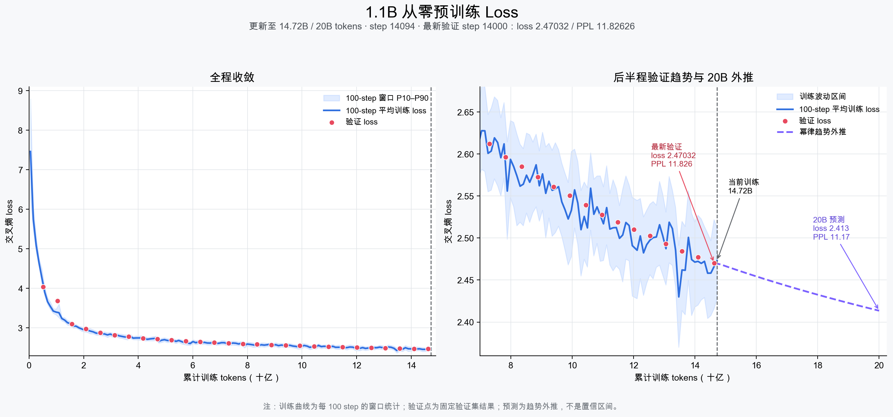

# High-quality English 1.1B pretraining

This is a from-zero pretraining pipeline for one NVIDIA L20. It does not load a
pretrained model or tokenizer. The model is a 1,100,048,384-parameter
TinyLlama-class decoder (22 layers, width 2048, 32 attention heads, 4 query
groups, SwiGLU 5632, context 2048) and the tokenizer is a newly trained 32K
byte-level BPE.

## Live evidence



The run is still in progress. Immutable environment, data, gate, benchmark,
and live-progress receipts are indexed in [`reports/`](reports/README.md).
Measured validation points and the explicitly labeled 20B-token extrapolation
are available as CSV files so the chart can be independently reproduced.
Checkpoint weights, source text, mutable logs, and raw TensorBoard events are
not stored in normal Git history.

## Data contract

The 20B-token production mixture is 42.5% FineWeb-Edu-Dedup score 4+, 42.5%
DCLM-Baseline, 3% FineMath-4+, and 12% permissively licensed Stack-Edu
Python/JavaScript/TypeScript/C++/Java at its release-validated educational
thresholds (score 3+; Java score 2+). This follows the short-horizon
foundation proportions supported by the SmolLM3 data ablations while keeping
the run English-only. Dataset revisions are pinned in `source_docs.py` and
`pipeline_config.json`; revision-bound Hub file lists are atomically cached so
resume does not depend on a fresh metadata API request. Cosmopedia remains only in the already-completed gate
and tokenizer sample; it is not part of the production 20B-token mixture.

Every accepted document passes English/content filters, global normalized-text
SHA-256 exact deduplication, and a 13-word benchmark decontamination check. The
PII status of DCLM is not documented, so DCLM email addresses and syntactically
valid IPv4 addresses are deterministically anonymized before deduplication and
tokenization. The validation split is a deterministic hash holdout. NumPy token shards are written
atomically with SHA-256 receipts and converted to LitData only after token-count
verification. Filtering and decontamination use six ordered worker processes,
tokenization uses exact-equivalent batched Rust encoding, Stack-Edu content uses
48 measured-concurrent SWH requests, and the next Parquet file is downloaded
while the current one is processed. Fully consumed raw
Parquet files are recorded in SQLite before
their cache copies are removed; the current partial file is retained for resume.

## Fail-closed execution

`build_data.py --stage gate` prepares four real-data samples. `run_gate.py` then
requires a successful 1,000-step run and checkpoint reload, finite validation
losses, at least 10K steady tokens/s, and at least 90% mean active GPU
utilization. `production_supervisor.py` refuses to create the full corpus or
start training unless those checks pass. It next requires exact agreement
between all source manifests, NumPy token counts, and packed LitData counts.

The full run uses BF16, compiled PyTorch SDPA, fused AdamW, micro-batch 6,
gradient accumulation 85, effective global batch 510 sequences, 1,000 optimizer
steps of warmup, and cosine decay from 4e-4 to 4e-5. It retains the two latest
complete step checkpoints and resumes automatically after interruption.

The packed reservoir contains at least 20.2B unique-source tokens (1% above the
nominal mixture; a resumed source may retain a larger verified reservoir).
Training is still capped at 19,999,703,040 effective prediction tokens,
exactly 19,148 complete optimizer steps. The reserve absorbs the 2049-input vs.
2048-target boundary and seeded weighted-sampling variance without cycling an
exhausted source.

## Operations

On the GPU host:

```bash
tmux list-sessions
tmux attach -t production
tmux attach -t production-watchdog
cat /home/hhai/pretrain/manifests/production-status.json
cat /home/hhai/pretrain/manifests/watchdog-status.json
cat /home/hhai/pretrain/manifests/training-gate-receipt.json
cat /home/hhai/pretrain/data/full-npy/math/progress.json
tail -f /home/hhai/pretrain/logs/production-supervisor.log
nvidia-smi dmon -s pucvmet
```

Important receipts live under `/home/hhai/pretrain/manifests`; logs are under
`/home/hhai/pretrain/logs`. The gate model is never used to initialize the full
run: `/home/hhai/pretrain/checkpoints/full` starts from random weights. The
final checkpoint is converted with the canonical `hf_config.py` architecture
and evaluated only after training has completed.

This pipeline maximizes evidence and quality within the fixed 20B-token budget;
it does not assert that a 20B-token model can be guaranteed to beat models
trained on trillions of tokens. That claim requires completed external benchmark
results, not configuration alone.
