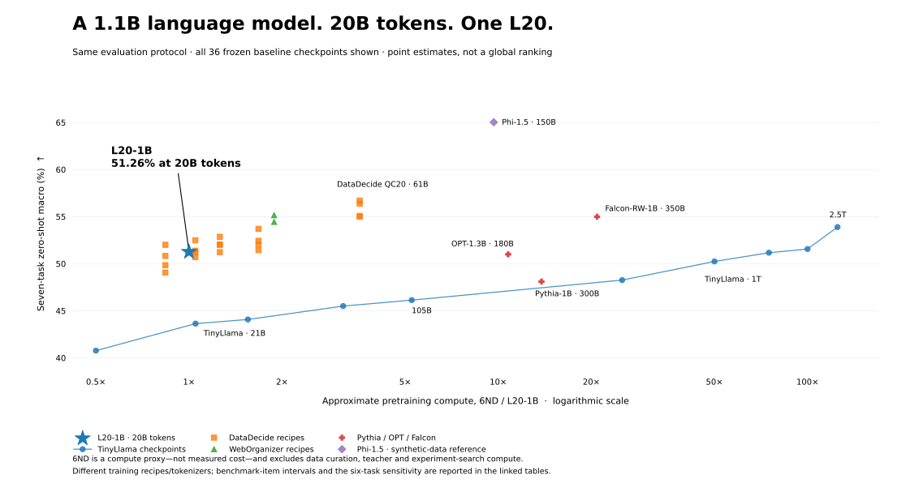

# L20 Pretraining Lab

**1.1B from scratch · 20B tokens · one NVIDIA L20**

[](https://github.com/yinli-systems/l20-pretraining-lab/actions/workflows/ci.yml)
[](LICENSE)
[](https://huggingface.co/AliceYin/L20-1B-20B-Base)

[Language results](results/language-model/README.md) · [Model card](pretraining/MODEL_CARD.md) · [Multimodal results](results/2026-09-28/README.md) · [Reproduce](docs/reproducibility.md)

A released English base language model, trained with a new tokenizer and random
model initialization. This repository pairs the training implementation with a
**36-checkpoint, same-protocol comparison** and follow-on multimodal experiments.
The language release and the experimental VLM are separate artifacts.

## Language results at a 20B-token budget

**51.26% seven-task macro · 49.94% excluding BoolQ.** In the frozen comparison,
L20-1B scores **+7.62 pp** above TinyLlama's 21B-token checkpoint and **+3.16 pp**
above Pythia-1B. Stronger baselines and non-wins remain visible below.



### Approximately 1B parameters, measured under one protocol

<!-- language-results:start -->

| Model / checkpoint | Parameters | Training tokens | 7-task ↑ | 6-task ↑ |
|---|---:|---:|---:|---:|
| **L20-1B · ours** | **1.10B** | **20B** | **51.26** | **49.94** |
| DataDecide · QC7/FW3 · 18B | 1.28B | 18.02B | 52.49 | 51.25 |
| TinyLlama · 21B | 1.10B | 21B | 43.64 | 41.18 |
| WebOrganizer · domain mix | 1.44B | 28.8B | 55.16 | 54.67 |
| Phi-1.5 (synthetic-data reference) | 1.42B | 150B | 65.03 | 63.41 |
| OPT-1.3B | 1.32B | 180B | 51.00 | 49.90 |
| Pythia-1B | 1.01B | 300B | 48.10 | 46.01 |
| Falcon-RW-1B | 1.31B | 350B | 54.99 | 53.82 |
| TinyLlama · 1T | 1.10B | 1T | 50.24 | 48.70 |
| TinyLlama · 1.5T | 1.10B | 1.5T | 51.17 | 49.94 |
| TinyLlama · 2T | 1.10B | 2T | 51.56 | 49.64 |
| TinyLlama · 2.5T | 1.10B | 2.5T | 53.89 | 52.38 |

<!-- language-results:end -->

Scores are percentages. **7-task:** HellaSwag, PIQA, WinoGrande, OpenBookQA,
ARC-Easy, ARC-Challenge and BoolQ; **6-task:** the same suite without BoolQ,
which was not explicitly decontaminated from the original training corpus.
All scores are our pinned **lm-eval 0.4.9 / zero-shot / BF16** re-evaluations,
not numbers mixed from different model cards. Parameters are measured totals.

Against **TinyLlama 1T**, the seven-task difference is **+1.02 pp**
(95% paired interval **[+0.16, +1.89]**), with **50× less reported token exposure**.
This does **not** establish 50× lower cost, equivalent overall capability, or
superiority to current small language models. OPT-1.3B and TinyLlama 1.5T/2T
intervals cross zero; stronger DataDecide, Falcon, Phi and later TinyLlama
results are retained. This is a frozen study, not a global leaderboard.

[**All 36 checkpoints, intervals and per-task scores →**](results/language-model/README.md)

Separate earlier, same-protocol checks also put **TinyLlama 3T at 52.78%** and
**TinyLlama v1.1 at 53.57%**, above our 51.26%. Those results remain available
in the [earlier comparison](pretraining/reports/research/tinyllama-comparison-20260911.md);
they are not silently substituted for intermediate checkpoints.

## What is released

| Artifact | What it contains | Status |
|---|---|---|
| **L20-1B-20B-Base** | 1,100,048,384 parameters; 32K byte-level BPE; 19,999,703,040 prediction tokens; model weights, training code and hash-bound evidence | **Language weights released** |
| **L20-VL-1.2B** | The language base plus externally pretrained SigLIP2; 1.203B total parameters; 10.28M trainable bridge/attention-LoRA parameters in the latest study | Experimental endpoint; **not promoted** |

The language run's covered logger intervals average **12,824 tokens/s**, with
**99.98% of optimizer steps covered**. Timing, MFU assumptions, data mixture and
release hashes are in the [model card](pretraining/MODEL_CARD.md) and
[unchanged reproduction bundle](pretraining/reproducibility/README.md).
The base LM is not an instruction- or safety-tuned chatbot. The combined VLM
is not fully pretrained from scratch.

## Multimodal expansion · September 28, 2026

After **5,120 updates / 163,840 new-image events**, the fixed endpoint was
compared on the same **15,937 published-split questions**. This uses a custom
model wrapper aligned to pinned task definitions, not a full `lmms-eval` CLI run.

| Task | Before | After | Change | Paired 95% interval, pp |
|---|---:|---:|---:|---:|
| TextVQA | 17.51 | **23.77** | **+6.27 pp** | [+5.35, +7.16] |
| DocVQA | 4.59 | **9.48** | **+4.89 pp** | [+4.22, +5.56] |
| ChartQA | 11.32 | 12.16 | +0.84 pp | [−0.16, +1.89] |
| AI2D | 7.32 | 26.26 | +18.94 pp | [+17.39, +20.60] |

**Not an all-purpose upgrade:** old natural-image QA fell **56.25% → 50.86%**,
triggering two consecutive retention failures and a protected stop. AI2D includes
answer-format repair; ChartQA's interval crosses zero. Intervals cover evaluation
sampling, not training-seed variance; two known ChartQA overlap questions remain
included and disclosed. The changed source mix/replay/formatting prevents a
data-only causal scaling claim. No frontier or SmolVLM-parity claim is made.

[Full report and evidence](results/2026-09-28/README.md) · [Earlier positive and negative experiments](L20-VL-1.2B/README.md)

## Verify in minutes, without a GPU

```bash
git clone https://github.com/yinli-systems/l20-pretraining-lab.git
cd l20-pretraining-lab
python3 tools/verify_repository.py
python3 tools/build_language_showcase.py --check
python3 pretraining/reproducibility/recompute.py
```

These commands verify stored evidence and presentation—not fresh model inference.
[Run the released model](pretraining/MODEL_CARD.md#quick-start) · [Tests and reproduction](docs/reproducibility.md)

## Repository map

```text
pretraining/       Language training, evaluation, original reports and tests
L20-VL-1.2B/       Multimodal implementation and historical experiments
results/           Language comparisons and dated multimodal result packages
assets/            Reproducible README figure and its source manifest
docs/              Architecture, limitations, reproduction and research notes
tools/             CPU verification and presentation generators
tests/             Repository and result regression checks
```

Original experiments, negative results and all **646 pre-refresh files** remain
preserved by hash in the [migration map](docs/layout-migration.json).
[Contributing](docs/CONTRIBUTING.md) · [Limitations](docs/limitations.md) · [Cite this project](CITATION.cff)

## License

Repository code and documentation: [MIT](LICENSE). External datasets, encoders,
baseline models and generated artifacts retain their own terms. Language weights
keep their existing Hugging Face name. Part of [Pretraining Lab](https://github.com/yinli-systems/pretraining-lab).
